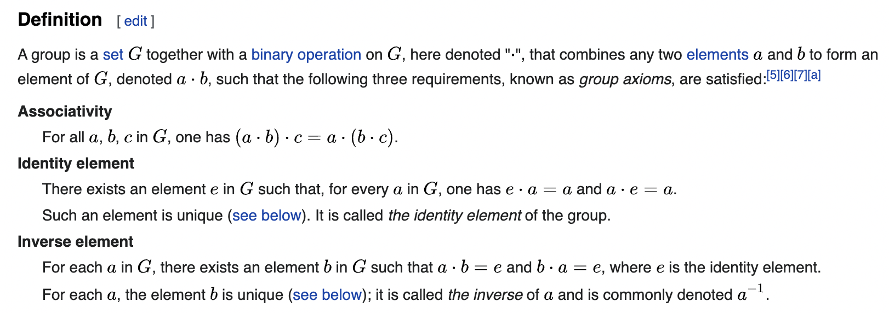

# Week1 Discussion supplementary

[toc]

## 1. Takeaways of Rules

- Penalty Manners
    - Late(over 15 minutes) or absent on discussion;
    - Leave discussion too early(leave discussion in 15 minutes after the start).
- [Reference to details](https://docs.google.com/document/d/1xkWfOSx-A7zRdHYwkHrIy_zUwBnhpf7fJGU4saH9OpY/edit)

## 2. Importance of the Learning Path
- Number theory are fundemental building blocks of cryptographic algorithm prevalently applied in dapps which are combined with zk-Snarks or zk-Starks.

- Without fundementally understanding of zero knowledge underlying mechanisms, it would be very limited to apply or develop zk practically, such as:
    - preventing application from low-level security concerns,
    - balance tradeoffs between security and efficiency theoretically.

## 3. Preliminary knowledge
- Definition of Group in number theory:
    
- [Reference link to wikipedia](https://en.wikipedia.org/wiki/Group_(mathematics))

