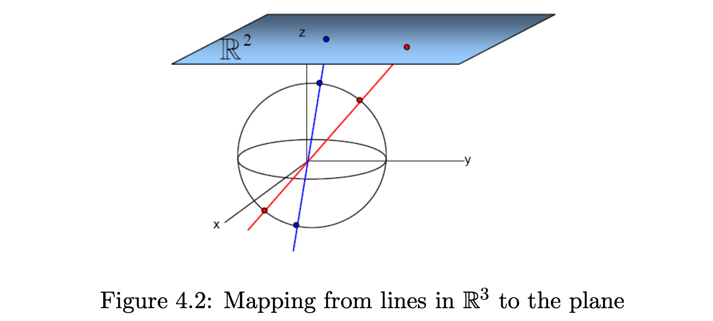
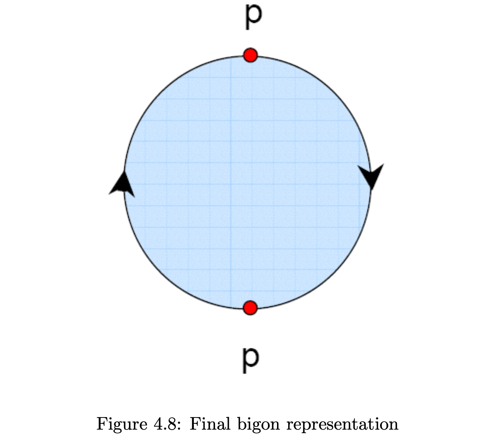
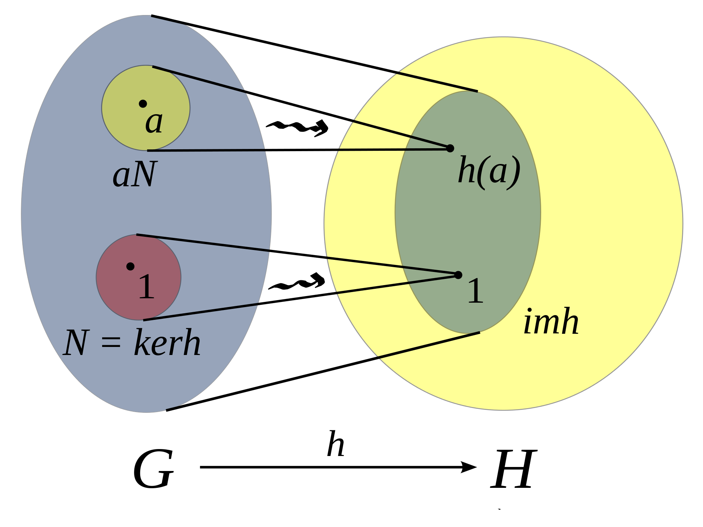

# W4 Discussion supplementary

[toc]

## 1. Field 
A field is a set on which addition, subtraction, multiplication, and division are defined and behave as the corresponding operations on rational and real numbers do.
- Properties
    - Associativity of addition and multiplication
    - Commutativity of addition and multiplication
    - Additive and multiplicative identity
    - Additive and multiplicative inverse
    - Distributivity of multiplication over addition

- Field of numbers

    - Field of complex numbers $\mathbb {C}$

    - Field of real numbers $\mathbb {R}$

    - Field of rational numbers $\mathbb {Q}$

## 2. Affine space and affine transformation

- Affine space: an affine space is an abstraction of how geometrical points(in the plane, say) behave. All points look alike, there is no point which is special in any way. You can't add points.
    - Easier understandable version: an affine space is what is left of a vector space after one has forgotten which point is the origin.
    - Affine space is a set $A$ together with a vector space $\overrightarrow{A}$

- Affine transformation of elliptic curve over $K$
    - characteristic of field is denoted as $charK$
    - Generalized Weierstrass equation: $y^2+a_1xy+a_3y=x^3+a_2x^2+a_4x+a_6$
    - $charK!=2$: 
        - Origin equation: $(y+a_1x/2+a_3/2)^2=x^3+(a_2+a_1^2/4)x^2+(a_4+a_1a_3/2)x+(a_3^2/4+a_6)$
        - After affine transformation $y_1=y+a_1x/2+a_3/2$: $y_1^2=x^3+a'_2x^2+a'_4x+a'_6$.
    - $charK!=3$: 
        - After affine transformation $y_1=y+a_1x/2+a_3/,x_1=x+a'_2/3$: $y_1^2=x_1^3+Ax_1+B$.
- Discriminant
    - For $y^2=^3+Ax+B$, if roots of cubic are $r_1, r_2, r_3$, then it can be shown that the discriminant of cubic is $((r_1-r_2)(r_2-r_3)(r_3-r_1))^2=(-4A^3+27B^2)$

## 3. Projective Plane
- It can be thought of as an ordinary plane equipped with additional "points at infinity" where parallel lines intersect.

*Parallel lines appear to intersect in the vanishing point at "infinity"*
    - $\mathbb{R}\mathbf{P}^2$: a line through then origin in $\mathbb{R}^3$
    

    - Begion representation
    

- Group homomorphism: given two groups, (G,\*) and (H,$\cdot $), a group homomorphism from (G,\*) to (H,$\cdot $) is a function $h$: $G$ -> $H$, such that for all $u$ and $v$ in $G$, it holds $h(u*v)=h(u)\cdot h(v)$.

## 4. Abelian group
- It's also called a commutative group, is a group in which the result of applying the group operation to two group elements does not depend on the order in which they are written. 
- Properties
    - Associativity
    - Identity element
    - Inverse element
    - Commutativity (Added property compared to generic group)