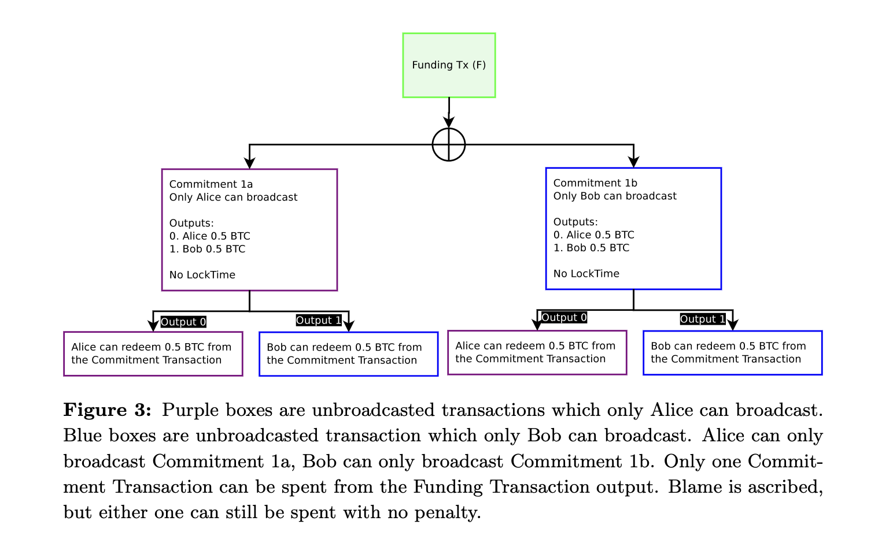
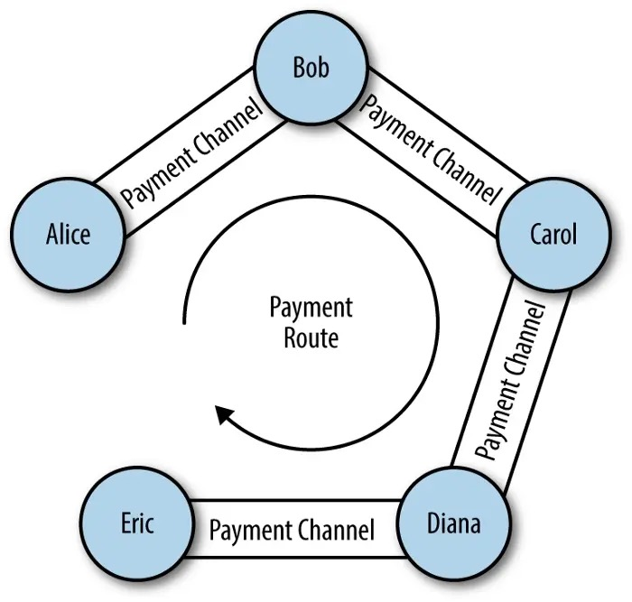
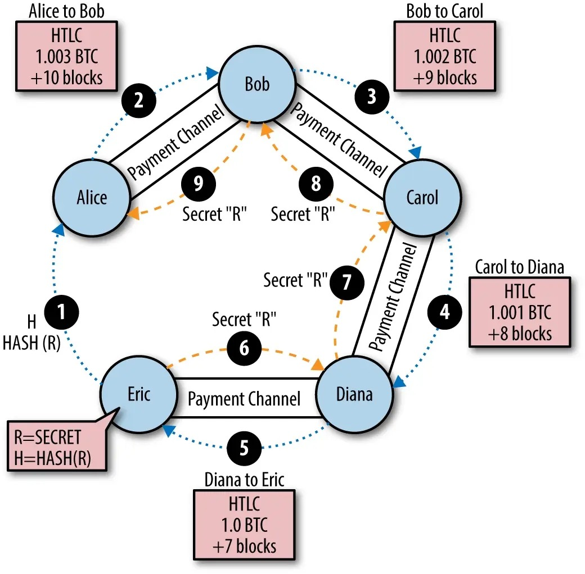

### Concept

"If only two participants care about an everyday recurring transaction, it's not necessary for all other nodes in the bitcoin network to know about that transaction."

---- From lighting network paper
简要概括来说，闪电网络是一个支持小额转账的通道（aka. 支付通道或交易通道），通道内的交易在链下发生。
由于交易的状态未实时更新在链上，为了解决交易延展性问题，本文提出了一种新的哈希签名方式使得通过转账路由的交易可去信任化执行。

### Definitions
- Transaction malleability
    在现实生活中，我们把一块金子敲变形之后，虽然形状有所改变，但质量却没有发生变化，也就是说金子外观发生了变化但是仍然被认可，这种特性呢被称为“可锻性”。
    
    在比特币系统中，也有一个类似的名词，“ Transaction Malleability ”。这个词通常翻译为“交易延展性”，也叫做“交易可锻性”，利用交易延展性而造成的攻击就叫交易延展性攻击。

    - 案例分析
        具体指的是比特币交易 A 发出之后，在还没有被确认之前，攻击者通过修改某些交易数据，使得一笔交易的唯一标识——交易哈希发生了改变，就形成了新的交易 B ，假如交易 B 先被记录到比特币账本中，那么交易 A 会因为双重支付问题，被验证为不合法，从而拒绝。
    - 闪电网络中的交易延展性问题
        当Alice、Bob共同创建的通道中的资产已经经过2次交易，且第二次交易是从Alice的资产中转出。如果Alice在广播交易时，隐藏第二次交易，则会导致Alice的账户余额高于实际值。

- Channel：
    开启通道，即两个参与方创建一个多签钱包，并向该钱包中充入资金，这个钱包接收到的资金数量就成为这个通道的余额。再然后，参与方之间的后续交易就全部在区块链以外的环境中发生了。任一参与方都能随时关闭这个通道，这时候，最后一笔链下的交易（决定着该通道各参与方的余额）会被发送到区块链上，同时作废掉所有中间的交易，因为所有这些交易都使用同样的交易输出。结果是，我们只需一笔交易来开启通道、一笔交易来关闭通道，中间所有的中间交易都是即时收发的，无需记录在区块链上（因此无需等待）。
    这样的通道所组成的网络使你可以向网络的另一个参与者发送资金，即使你们之间并无直接的通道。唯一的条件是你们之间要能形成一条 “路径”，即有通道能前后相接地把你和对方联系起来。此外，得益于特殊的智能合约（HTLC，哈希时间锁合约），你不需要信任网络中的任何人，合约会保证安全地交付你支付的资金。

- SIGHASH NOINPUT:
    - 由于通道创建后，双方需要创建交易后才能交换并补齐各自对Parent交易和Child交易的签名，因此需要用SIGHASH NOINPUT先构建交易输入哈希。

- LockTime and Sequence Number
    nLockTime 表示交易是否会被积压；当默认 nLockTime=0 时，代表这笔交易不会积压，节点在收到这笔交易之后，立即会进入 Memory Pool，进行打包。当 nLockTime > 0 时，这笔交易会被节点暂时 Hold，不会被矿工打包。

    nLockTime 是 Transaction 级别的，而 Sequence Number 是 Input 级别的，粒度更细。原理和 nLockTime 类似，Sequence Number 的作用也是把交易 Hold 在那，等到该 Input 所引用的交易所在的 Block，其后面跟随了 Sequence Number 个区块之后，该交易才能被打包，被广播进区块链网络。

    两者都是关于时间的，但有 1 个很大差别：nLockTime ：绝对时间，用的是整个区块链的长度或时间戳来表达的。sequence number: 相对时间，当前交易所引用的 UTXO 所在的块，后面追加了多少个块。

    - nLockTime: 代表交易被允许被被打包的最早时间。nLocktime允许签名者创建一个时间锁定交易。因为只会在将来生效，这给签名者一个的反悔的机会。如果其中任何一个签名者反悔了，他可以创建一个没有locktime 的交易。因为新创建的交易可以花掉旧交易的那部分input，所以旧交易在lock time解锁后 找不到可以花掉的input，旧交易就失效了。
    - Sequence Number: The pre-signed child transaction can be redeemed after the parent transaction has entered into the blockchain with 1000 confirmations, due to the child’s nSequence number on the input spending the parent.
    In order to revoke this signed child transaction, both parties just agree to create another child transaction with the default field of the nSequence number of MAX INT, which has special behavior permitting spending at any time.

- Buffer capital
- Watchtowers

### 通道生命周期管理
1. 通道的创建: 
    第一笔交易决定了一个通道的余额，我们称为 “充值事务” 或者 “锚点事务”。这笔交易需要广播到网络中并记录到区块链上，以表明通道开启。为了保证任意一方能成功redeem多钱合约内余额，双方需先交换验证redeem的交易承诺。
    - 案例：
        - Alice和Bob同意各自将0.5 BTC打入一个签名通过要求为2:2的多签合约地址中。
        - 两者先创建一个交易承诺，交易内容为将多签余额转给Alice和Bob各0.5 BTC。在各自签名后，将本次签名的key交换，由此单方即可将交易广播。（需注意：该交易承诺只有Outputs没有Inputs）
        - 在验证完交易承诺后，双方交换创建该多签合约的签名，将其广播在链上并确认交易。当前多签地址余额为1 BTC。
2. 通道关闭的两种方式: 
    - 双方一致同意关闭，将结算的Transaction Commitment发送到网络中。
    - 如果某一方不在线，另一方也可将结算的交易凭证发送到网络中，等时间锁解锁后，解锁其锁定的部分。
3. 通道内Transaction Commitment
    - 序列久期可撤回合约(RSMC:Revocable Sequence Maturity Contract)
        （1） 案例：在通道创建后，Alice拿到Bob签名的Transaction有两个输出，第一个不带时间锁且接受人为Bob，第二个带时间锁且接受人为Alice。
        其中，第一个输出在交易上链后就能使用，第二个输出需要在交易上链后再过1000个区块方可使用。
        
        （2）代码解释：第一个输出是即时生效给Bob的0.5 BTC。第二个输出的使用有两种方式，在时间锁限制内，Bob可以通过撤销密钥将该输出的0.5 BTC归为己有；当交易广播后超过时间锁限制，则Alice可使用该0.5 BTC。

        ```
        Input: 2-of-2 funding output        ​
        Output 0 <0.5 bitcoin>:
            # 检查接收者是否为Bob
            <Bob’s Public Key> CHECKSIG
        ​
        Output 1 <0.5 bitcoin>:
            IF
                # 检查撤销密钥是否正确
                <Revocation Public Key> CHECKSIG
            ELSE
                # 检查时间锁是否终止
                <1000 blocks> CHECKSEQUENCEVERIFY
                DROP
                # 检查接收者是否为Alice
                <Alice’s Public Key> CHECKSIG
            ENDIF
        ```
        （3）旧Transaction Commitment的可撤销性：当通道双方想发起新交易，为了防止一方通过广播旧交易作恶，则双方需先交换撤销密钥，然后再对新交易各自进行签名。
4. 通道间交易传递
    - 哈希时间锁合约(HTLC:Hashed Timelock Contract)：通过哈希验证和过期验证进行通道间交易传递。
        （1）案例：Eric生成一个密钥R，并将其哈希值H发给Alice。Alice创建一个HTLC，并将时间锁设为10个区块，同时支付1.003 BTC（0.003 BTC作为通道费）给Bob。如果在10个区块后，哈希锁不能被解开，则Alice可拿回合约中的1.003个BTC。
        接下来通道路由中的其他人回依次创建HTLC并收取各自的通道费，同时在交易传递过程中，时间锁的数值递减。
            <!--  -->
            
        （2）代码解释：
        ```
        # 检查所提供的 R 是否为 H 的原像
        HASH160 <H> EQUAL
        IF
            # 检查公开 R 的人是否为Transaction Commitment最初的接收者
            <Payee Public key> CHECKSIG
        ELSE
            # 检查时间锁是否已终止
            <locktime> CHECKLOCKTIMEVERIFY
            # 检查请求返回资金的是不是Transaction Commitment最初的发送者
            <Payer Public Key> CHECKSIG
        ENDIF
        ```
        （3）通道的连接性和去信任化：只要有路由通路存在，收发双方无需建立两者间的通道，便能进行交易。同时，由于时间锁存在，即使路由中的某个环节出故障也能取回已锁定在合约中的资金。
### 密钥使用与存储

- Timestop
Allow miner to specify whether the current (fee paid) mempool is presently being flooded with transactions.
    - Enter a "1" value into the last bit in the version number of the block header.
    - Uncongested block height (which is always lower than the normal block height), this block height is used for the nSequence value, which only counts block confirmations. 

## Reference
- https://learnblockchain.cn/article/3007
- https://learnblockchain.cn/article/3008
- https://www.hellobtc.com/kp/kc/08/2111.html
- https://www.bookstack.cn/read/bitcoin_developer_guide/locktime_and_sequence_number.md
- https://www.geekmeta.com/article/1114107.html